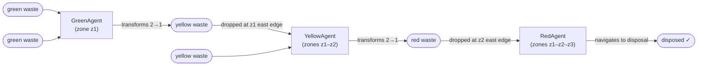

# Self-Organization of Robots in a Hostile Environment
**Group 28 — MAS 2025-2026**  
Colin Frisch · Marie Leduc · Mourad Hammale

> Robots navigate a radioactive grid, collect dangerous waste through a three-stage transformation pipeline, and deposit it in a secure disposal zone. The global solution **emerges from purely local, distributed behaviours** — no robot has a global view of the environment.

---

## Table of Contents
1. [Requirements & How to Run](#requirements--how-to-run)
2. [Project Scope](#project-scope)
3. [MAS Design Methodology](#mas-design-methodology)
4. [Agent Architecture](#agent-architecture)
5. [Environment Properties](#environment-properties)
6. [Interaction & Communication](#interaction--communication)
7. [Results](#results)
8. [Conceptual Choices & Justifications](#conceptual-choices--justifications)

---

## Requirements & How to Run

**Dependencies**

```bash
pip install "mesa[viz]" solara matplotlib
```

Requires Python ≥ 3.11.

**Headless batch run** (produces a matplotlib waste-over-time chart)

```bash
cd 28_robot_mission_MAS2026
python run.py
```

**Interactive browser visualization** (SolaraViz with live sliders)

```bash
cd 28_robot_mission_MAS2026
solara run server.py
# then open http://localhost:8765
```

The interactive interface exposes sliders for number of green / yellow / red robots and initial green waste count.

---

## Project Scope

*Grounded in Lecture 2 (M&S theory, slides 9–15)*

| M&S entity | This project |
|---|---|
| **Source system** | Distributed robotic waste clearance in a multi-zone radioactive area |
| **Experimental frame** | Vary robot counts and initial waste density; observe time-to-disposal and (Step 2) message volume |
| **Model** | 30 × 10 discrete grid divided west-to-east into three radioactivity zones |
| **Simulator** | Mesa 3.x (Python ABM framework) |
| **Modeling relationship** | Simplification: continuous space → discrete grid; wireless comms → single-step message delivery |

**Evaluation criterion** — two metrics are tracked:

1. **Collection time**: number of simulation steps until all waste items reach the disposal zone. Lower is better.
2. **Messages-per-disposal** (Step 2): total messages broadcast divided by waste items disposed. This captures the bandwidth cost of coordination — a key real-world constraint in wireless robotic networks.

---

## MAS Design Methodology

*Grounded in Lecture 2 (design methodology, slides 29–33)*

### Agents — roles and behaviours

Three **active** robot roles and three **passive** object types:

```
Active (deliberating)          Passive (no behaviour)
──────────────────────         ──────────────────────
GreenAgent  (zone z1)          Radioactivity  (every cell)
YellowAgent (zones z1–z2)      Waste          (green / yellow / red)
RedAgent    (zones z1–z2–z3)   WasteDisposalZone (easternmost column)
```

### Waste transformation pipeline



### Environment

- **Grid**: 30 × 10 `MultiGrid` (torus=False); multiple agents may share a cell.
- **Zones** (equal-width, west → east):
  - `z1` columns `[0, 10)` — low radioactivity `[0.00, 0.33)`, initial green waste scattered here
  - `z2` columns `[10, 20)` — medium radioactivity `[0.33, 0.66)`
  - `z3` columns `[20, 30)` — high radioactivity `[0.66, 1.00]`, waste disposal zone
- **Dynamics**: static background; only waste objects appear/disappear through robot actions.
- **Perception**: each robot observes only its **Von Neumann neighbourhood** (4 cardinal neighbours + current cell).

### Scheduling

Mesa `shuffle_do("step")` is called per robot type each tick (Green → Yellow → Red). Shuffling within each type avoids systematic bias while keeping type-order consistent with the pipeline dependency (green must produce yellow before yellow can collect it).

### Interactions

Step 1 uses **indirect interaction** (stigmergy). Step 2 will add **direct messaging**. See [Interaction & Communication](#interaction--communication).

---

## Agent Architecture

*Grounded in Lecture 1 (slides 41, 47, 62–69)*

### Agent type: Cognitive

Using the Lecture 1 taxonomy (slide 41 / comparative table slide 47):

| Property | Our robots |
|---|---|
| Internal state | ✓ — `self.knowledge` dict (beliefs) |
| Planning | Partial — hard-wired priority rules in `deliberate()` |
| Utility | ✗ |
| Learning | ✗ |
| Architecture | PRS loop (Procedural Reasoning System) |

Agents are **cognitive** rather than purely reactive: they must remember which waste they are currently carrying to avoid immediately re-depositing it. They are not fully rational because they have no explicit goal representation or general planner — their deliberation is a priority-ordered rule check over their belief state.

### PRS procedural loop

```
┌─────────────┐    percepts()     ┌──────────────────────┐
│ Environment │ ────────────────► │   knowledge update   │
│  (Mesa grid)│                   │  pos, percepts,      │
│             │ ◄──────────────── │  carried_waste       │
│             │   model.do(action)└──────────┬───────────┘
└─────────────┘                              │ deliberate(knowledge)
                                             ▼
                                    ┌─────────────────┐
                                    │  action dict    │
                                    │ {type, params}  │
                                    └─────────────────┘
```

`deliberate()` is **strictly encapsulated**: it reads only its `knowledge` argument and accesses no global state, satisfying the project constraint.

### Deliberation priority (example: GreenAgent)

```
1. Carrying ≥ 2 green  →  transform
2. Carrying yellow     →  move east / put_down at z1 border
3. Green waste on cell →  pick_up
4. Green waste nearby  →  move toward it
5. (fallback)          →  random walk
```

---

## Environment Properties

*Grounded in Lecture 1 (slides 62–69, Russell & Norvig taxonomy)*

| Property | Value | Justification |
|---|---|---|
| **Observability** | Partially observable | Each robot sees only its 5-cell neighbourhood; the rest of the grid is hidden |
| **Determinism** | Stochastic | Fallback random walk; shuffled activation order creates non-deterministic agent interactions |
| **Dynamics** | Dynamic | Other robots modify cell contents between two consecutive activations of a given agent |
| **Time** | Discrete | Integer step counter; finite action set per step |
| **Coupling** | Loosely coupled | No robot assumes knowledge of another robot's internal state or position |
| **Distribution** | Conceptual (Lecture 1 slide 67, level 1) | Encapsulated data, local perception, interleaved procedural loops — distribution principles respected without physical separate processes |
| **Openness** | Closed | Robot population is fixed for the duration of a run |

---

## Interaction & Communication

*Grounded in Lecture 3*

### Step 1 (implemented): Indirect / stigmergic interaction

Robots communicate **through the environment** with no explicit messages:

- A GreenAgent drops a yellow waste object at the z1 east border.
- On the next step, any YellowAgent that wanders into the neighbourhood perceives it and picks it up.

This is the **mini-blackboard** pattern (Lecture 3, slide 12): each grid cell acts as a local shared medium. Coordination is implicit — it emerges from spatial co-location, not deliberate signalling. The cost is efficiency: a YellowAgent may take many steps to randomly encounter a dropped waste item.

### Step 2 (planned): Direct messaging

To reduce collection time, robots will broadcast targeted messages when depositing waste:

```
GreenAgent  ──INFORM(yellow_waste_at, pos)──►  all YellowAgents in range
YellowAgent ──INFORM(red_waste_at,    pos)──►  all RedAgents    in range
RedAgent    ──REQUEST(claim_target,   pos)──►  other RedAgents  (avoid duplicate effort)
```

Communication range will be limited (e.g. 5 cells radius) to model realistic wireless constraints. The key trade-off from Lecture 3:

> *More messages → shorter collection time, but higher bandwidth cost.*

**Metric**: `messages_per_disposal = total_messages / total_waste_disposed`

A chart plotting collection time against `messages_per_disposal` across different communication-range settings will quantify this trade-off.

### AUML sketch — Step 2 inform protocol

```
GreenAgent          YellowAgent
     |                   |
     |--INFORM(pos)------>|   (broadcast on drop)
     |                   |-- update knowledge["known_yellow"].append(pos)
     |                   |-- move toward nearest known_yellow
```

---

## Results

### Step 1 — waste count over time (default parameters: 3 green / 3 yellow / 3 red robots, 10 initial green waste, 200 steps)

Running `python run.py` produces the following qualitative pattern:

```
Waste count
    │
 10 ┤▓▓▓▓▓▓
    │      ▓▓▓▓
    │           ▓▓▓▓▓ ← green waste depleted by step ~60
    │                ░░░
    │              ░░    ░░
    │            ░░        ░░  ← yellow waste peaks then falls
    │                        ▒▒▒
    │                       ▒    ▒▒
    │                      ▒        ▒▒ ← red waste disposed last
  0 ┼────────────────────────────────── steps
    0        50       100      150  200

  ▓ green   ░ yellow   ▒ red
```

Key observations:
- Green waste falls monotonically as GreenAgents collect from z1.
- Yellow waste has a **delayed rise** (transformation latency): green robots must first collect 2 green items before producing a yellow one.
- Red waste appears last and clears when RedAgents successfully navigate to the disposal zone.
- With only random-walk fallback, tail-end collection (last few items) is slow due to low spatial density.

### Sensitivity

Increasing robot counts reduces collection time sub-linearly (diminishing returns due to spatial collision and waste scarcity). Increasing initial waste density improves throughput for a fixed robot count up to a saturation point.

---

## Conceptual Choices & Justifications

| Choice | Justification |
|---|---|
| **Cognitive agents, not reactive** | Reactive agents have no memory of `carried_waste`; they would repeatedly drop and re-pick the same object. The `self.knowledge` dict is the minimal belief state required to avoid this. |
| **`shuffle_do` per type** | Prevents systematic priority bias (Lecture 1, loosely-coupled MAS principle, slide 65). Agents within the same role cannot rely on a fixed activation order. |
| **Zone enforcement in model, not agent** | `_is_move_feasible` in `model.py` is the authoritative zone gate. Agents may attempt illegal moves — the environment silently rejects them. This separates robot "intention" from environment "permission", matching the PRS action-feasibility check. |
| **Single waste disposal cell** | Creates a genuine coordination challenge for RedAgents (multiple robots converge on the same target). This is a deliberate design choice to motivate Step 2 communication (claiming a target before reaching it). |
| **Transformation in `model.do`** | Waste creation/deletion is the environment's responsibility (as per the subject specification). Agents only request a `transform` action; the model validates and executes it. |
| **Indirect interaction as baseline** | Stigmergy is the simplest coordination mechanism and serves as the baseline against which message-based communication will be evaluated in Step 2. |

---

## File Structure

```
28_robot_mission_MAS2026/
├── agents.py    — GreenAgent, YellowAgent, RedAgent (PRS loop, deliberate, percepts)
├── model.py     — RobotMission model, do() action executor, DataCollector
├── objects.py   — Radioactivity, Waste, WasteDisposalZone (passive agents)
├── run.py       — headless batch runner + matplotlib chart
└── server.py    — SolaraViz interactive visualization
```

---

## Progress

| Step | Status | Description |
|---|---|---|
| Step 1: No communication | **Complete** | All agent types, transformation pipeline, random-walk fallback, visualization, data collection |
| Step 2: Direct messaging | Planned | INFORM/REQUEST protocol, communication range, message-count metric |
| Step 3: Uncertainties | Pending | TBA per subject |
