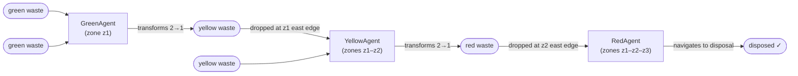
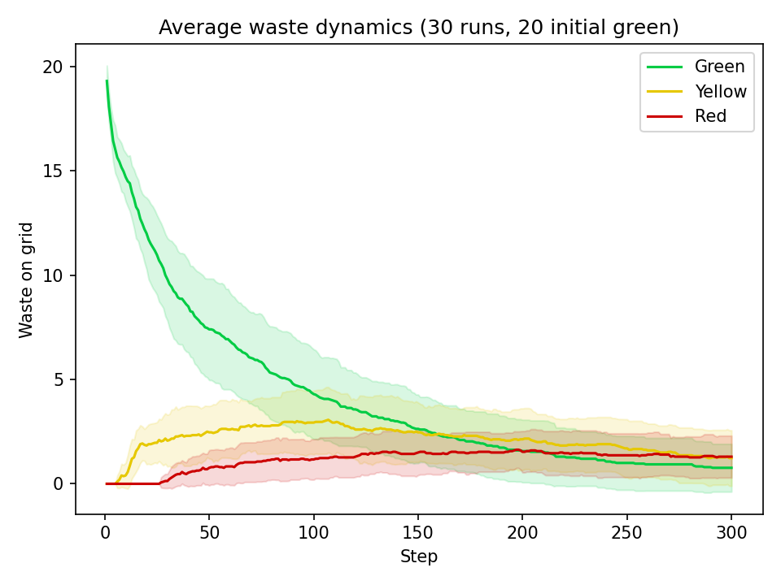
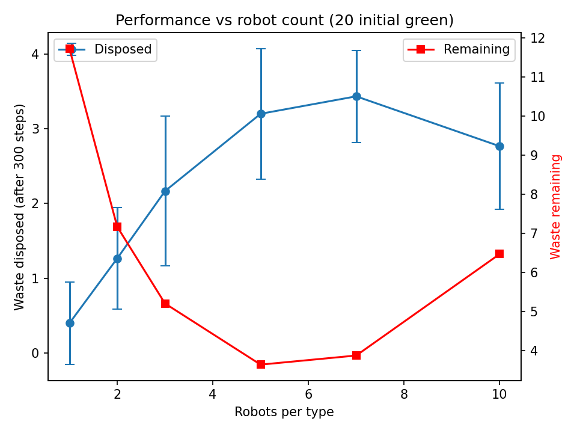
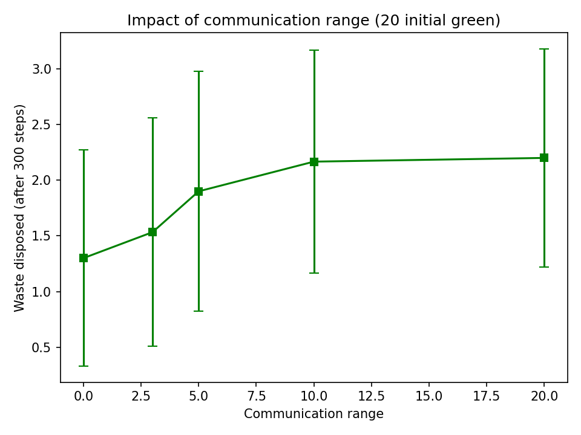
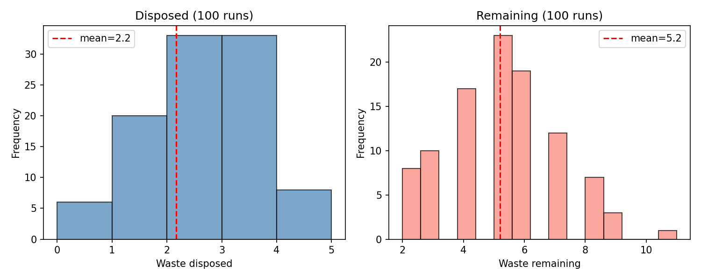

# SMA: self-organisation of robots in a hostile environment
**Group 28**  
Colin Frisch, Marie Leduc, Mourad Hammale

> Robots navigate a radioactive grid, collect dangerous waste through a three-stage transformation pipeline, and deposit it in a secure disposal zone. The global solution comes from local behaviours, as the robots do not have a global view of the environment.

## Requirements and how to run

**Dependencies**

```bash
pip install -r requirements.txt
```

Requires Python ≥ 3.11.

**Headless batch run** (produces a matplotlib waste-over-time chart)

```bash
cd 28_robot_mission_MAS2026
python run.py
```

**Interactive browser visualization** (SolaraViz with live sliders)

```bash
cd 28_robot_mission_MAS2026
solara run server.py
```

The interactive interface shows sliders for number of green / yellow / red robots and initial waste count (green, yellow and red)


## Evaluation

We track three metrics across batch runs (30 runs per configuration, 300 steps each):

1. Waste disposed: number of red waste items successfully delivered to the disposal zone. Higher is better. Due to the 2-to-1 transformation pipeline (10 green → 5 yellow → ≤5 red), the theoretical maximum is roughly N/4 for N initial green wastes.
2. Waste remaining: total waste still in the system (on grid + carried by robots). Lower is better. A non-zero floor is expected because of structural deadlocks (agents carrying 1 waste with no partner to pair).
3. Total messages: number of broadcast messages sent. Captures coordination cost.


## Overall functionning of the system

### Role of robots

We have three *active* robot roles and three *passive* object types:

```
Active (deliberating)          Passive (no behaviour)
──────────────────────         ──────────────────────
GreenAgent  (zone z1)          Radioactivity  (every cell)
YellowAgent (zones z1–z2)      Waste          (green / yellow / red)
RedAgent    (zones z1–z2–z3)   WasteDisposalZone (easternmost column)
```

### Waste transformation pipeline



### Environment

- *Grid*: 30 × 10 `MultiGrid`, and multiple agents may share a cell.
- *Zones* (of equal width):
  - `z1` columns `[0, 10)`: low radioactivity `[0.00, 0.33)`, initial green waste here
  - `z2` columns `[10, 20)`: medium radioactivity `[0.33, 0.66)`
  - `z3` columns `[20, 30)`: high radioactivity `[0.66, 1.00]`, waste disposal zone
- *Background*: static background; only waste objects appear/disappear through robot actions.
- *Perception*: each robot observes only its neighbourhood (4 neighbours and the current cell).

### Scheduling

Mesa `shuffle_do("step")` is called per robot type each tick (Green, then Yellow, then Red). Shuffling within each type avoids systematic bias while keeping type-order consistent with the dependencies (green must produce yellow before yellow can collect it for example).


## Agent architecture

### Agent type: cognitive

| Property | Our robots |
|---|---|
| Internal state | ok, `self.knowledge` dict (beliefs) |
| Planning | partial, hard-wired priority rules in `deliberate()` |
| Utility | X |
| Learning | X |
| Architecture | PRS loop (Procedural Reasoning System) |

Agents are cognitive instead of reactive: they have to remember which waste they are carrying to avoid immediately re-deposing it. They are not completely rational because they have no goal representation or planner, so their deliberation is a priority-ordered rule check over their belief state

### PRS procedural loop

```
┌─────────────┐    percepts()     ┌──────────────────────┐
│ Environment │ ────────────────► │   knowledge update   │
│  (Mesa grid)│                   │  pos, percepts,      │
│             │ ◄──────────────── │  carried_waste       │
│             │   model.do(action)└──────────┬───────────┘
└─────────────┘                              │ deliberate(knowledge)
                                             ▼
                                    ┌─────────────────┐
                                    │  action dict    │
                                    │ {type, params}  │
                                    └─────────────────┘
```

`deliberate()` is strictly encapsulated: it reads only its `knowledge` argument and accesses no global state, satisfying the project constraint.

### Deliberation priority (using Green Agent as an example)

```
1. Carrying over 2 green: transform
2. Carrying yellow: move east / put_down at z1 border
3. Green waste on cell: pick_up
4. Green waste nearby: move towards it
5. (fallback): random walk
```

---

## Environment properties

| Property | Value | Justification |
|---|---|---|
| *Observability* | Partially observable | Each robot sees only its 5-cell neighbourhood; the rest of the grid is hidden |
| *Determinism* | Stochastic | Fallback random walk; shuffled activation order creates non-deterministic agent interactions |
| *Dynamics* | Dynamic | Other robots modify cell contents between two consecutive activations of a given agent |
| *Time* | Discrete | Integer step counter; finite action set per step |
| *Coupling* | Loosely coupled | No robot assumes knowledge of another robot's internal state or position |
| *Distribution* | Conceptual (Lecture 1 slide 67, level 1) | Encapsulated data, local perception, interleaved procedural loops : distribution principles respected without physical separate processes |
| *Openness* | Closed | Robot population is fixed for the duration of a run |

---

## Steps

### Step 1 (already implemented): indirect interaction

Robots communicate through the environment with no explicit messages:

- A Green Agent drops a yellow waste object at the z1 east border.
- On the next step, any Yellow Agent that wanders into the neighbourhood perceives it and picks it up.

This is technically a mini-blackboard pattern because each grid cell acts as a local shared medium. Coordination is implicit in the pattern as it emerges from spatial co-location, there is no deliberate signalling. The cost is efficiency: a Yellow Agent may take many steps to randomly encounter a dropped waste item.

### Step 2: adding yellow and red waste

Instead of only having initial *green* waste, there is an option to begin with yellow and red waste as well. Configurable via UI sliders and model parameters.

### Step 3: direct messaging

To reduce collection time, robots will exchange targeted messages when depositing waste:

```
GreenAgent  ──INFORM(yellow_waste_at, pos)──►  all YellowAgents in range
YellowAgent ──INFORM(red_waste_at, pos)──►  all RedAgents    in range
RedAgent    ──REQUEST(claim_target, pos)──►  other RedAgents  (avoid duplicate effort)
```

More messages mean shorter collection time, but higher bandwidth cost.

**Metric**: `messages_per_disposal = total_messages / total_waste_disposed`

A chart plotting collection time against `messages_per_disposal` across different communication-range settings will quantify this.

### AUML sketch

```
GreenAgent          YellowAgent
     |                   |
     |--INFORM(pos)------>|   (broadcast on drop)
     |                   |-- update knowledge["known_yellow"].append(pos)
     |                   |-- move toward nearest known_yellow
```


## Results

Results are generated by `batch_run.py` (30 runs per data point, 300 steps, 20 initial green wastes). See the [Batch run analysis](#batch-run-analysis) section for full plots and interpretation.

Key findings:
- Waste dynamics: green waste clears within ~150 steps; yellow peaks around step 30–50 then decays; red accumulates slowly and plateaus as the disposal bottleneck kicks in.
- Optimal robot count: performance peaks at 5–7 robots per type, then **degrades** with 10 due to congestion (too many agents competing for too few waste items, causing pairing deadlocks).
- Communication helps: +70% disposal going from no communication (range=0) to range=10, then saturation : the 30-wide grid is mostly covered at range=10.
- High variance: disposed count ranges from 0 to 5 across 100 runs (mean=2.2, std=1.0), showing the system is sensitive to initial conditions and random-walk paths.

---

## Conceptual choices and justifications

| Choice | Justification |
|---|---|
|Cognitive agents, not reactive| Reactive agents have no memory of `carried_waste`; they would repeatedly drop and re-pick the same object. The `self.knowledge` dict is the minimal belief state required to avoid this. |
| `shuffle_do` per type | Prevents systematic priority bias (Lecture 1, loosely-coupled MAS principle, slide 65). Agents within the same role cannot rely on a fixed activation order. |
| Zone enforcement in model, not agent | `_is_move_feasible` in `model.py` is the authoritative zone gate. Agents may attempt illegal moves : the environment silently rejects them. This separates robot "intention" from environment "permission", matching the PRS action-feasibility check. |
| Single waste disposal cell | Creates a genuine coordination challenge for RedAgents (multiple robots converge on the same target). This is a deliberate design choice to motivate Step 2 communication (claiming a target before reaching it). |
| Transformation in `model.do` | Waste creation/deletion is the environment's responsibility (as per the subject specification). Agents only request a `transform` action; the model validates and executes it. |
| Indirect interaction as baseline | Stigmergy is the simplest coordination mechanism and serves as the baseline against which message-based communication will be evaluated in Step 2. |

---

## File structure

```
28_robot_mission_MAS2026/
├── agents.py
├── model.py
├── objects.py
├── run.py
├── server.py
└── batch_run.py
```

---

## Progress

| Step | Status | Description |
|---|---|---|
| Step 1: No communication | Completed | All agent types, transformation pipeline, random-walk fallback, visualization, data collection |
| Step 2: Additional waste | Completed | Yellow and red waste initialization via UI sliders, placement respects robot zones |
| Step 3: Direct messaging | Completed | INFORM/REQUEST protocol, configurable communication range, `messages_per_disposal` metric tracked |

---

## BONUS : Batch run analysis

Run `python batch_run.py` to reproduce these experiments (30 runs per data point, 300 steps each, 20 initial green wastes unless stated otherwise). Plots are saved as `batch_*.png`.

### 1. Average waste dynamics



Green waste decreases monotonically as GreenAgents collect it. Yellow waste rises briefly (transformation lag) then falls as YellowAgents consume it. Red waste rises last and plateaus : red waste accumulates because the pipeline produces it faster than the single disposal zone can absorb it. The shaded band (±1 std) shows moderate inter-run variance, especially for the later pipeline stages where stochastic delays compound.

### 2. Performance vs robot count



| Robots/type | Disposed (mean) | Remaining (mean) |
|---|---|---|
| 1 | 0.4 | 11.7 |
| 3 | 2.2 | 5.2 |
| 5 | 3.2 | 3.6 |
| 7 | 3.4 | 3.9 |
| 10 | 2.8 | 6.5 |

Performance peaks at 5–7 robots per type, then drops with 10. This is a congestion effect: too many robots compete for the same waste, and the pairing constraint (need 2 to transform) means more agents carrying 1 waste each with nothing to pair it with. The optimal point balances collection speed against coordination overhead.

### 3. Impact of communication range



Communication improves disposal by approximately 70% (1.3 → 2.2 disposed) going from range=0 to range=10. Beyond range=10, gains saturate : the grid is only 30 cells wide, so range=10 already covers most of the relevant area. The high variance (error bars) shows that communication helps on average but does not eliminate the stochastic nature of the system.

### 4. Distribution over 100 runs



- Disposed: mean=2.2, std=1.0, range [0, 5]. The mode is 2–3, matching the theoretical pipeline ratio (20 green → 10 yellow → 5 red → 5 disposed max; real throughput is lower due to pairing failures and spatial search time).
- Remaining: mean=5.2, std=1.8. The right tail (8–11 remaining) corresponds to runs where agents get stuck carrying unpaired waste : a structural deadlock inherent to the greedy pairing strategy.
